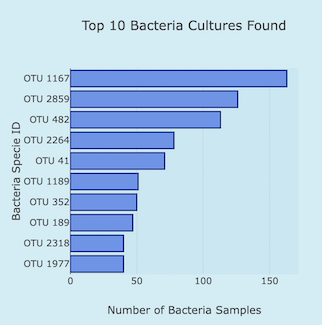
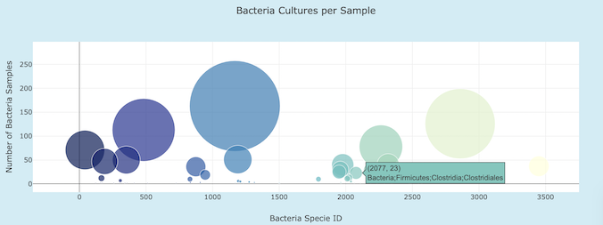
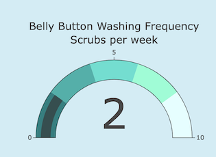

# Plotly_Deployment

## Project Overview

Build an interactive website using JavaScript to make data visualizations attractive and accessible. Displaying charts that represent the results of a study of bacterias found on the human belly button with the purpose to find the ideal bacteria type for the production of improbable beef, where people from around the US participated and their identities were kept anonymous by having ID number assigned to each of them, which can be used for them to access their results on the website.

## Design Solution

- Use Plotly to offer interactivity and make the results of the data findings easier to understand as well as add mobile responsiveness to the webpage.
- Use javaScript to manipulate, parse, and transform data.
- Use JavaScript D3 library to create interactive features such as drop-down menus and buttons, and also retrieve data from external sources. 

- Customize the dashboard using bootstrap, HTML, and a local CSS file.
- Deploy the final work to Github pages.

### Horizontal Bar Chart

- The chart below represents the number of bacteria samples vs the bacteria specie ID found on the selected subject ID.

### Bubble Chart

- The following chart displays the bacteria specie ID vs the number of bacteria samples where the size of each bubble is determined by the number of bacteria samples.

### Gauge Chart

- The chart below shows the belly button washing frequency of the selected subject ID in a very easy and fun way.

